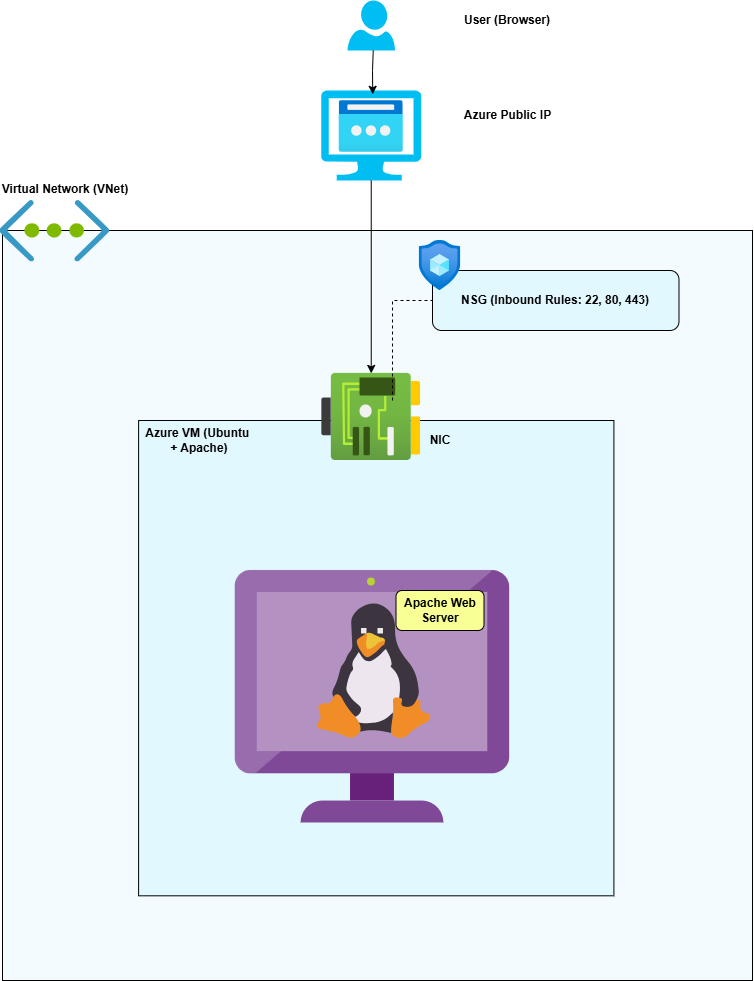
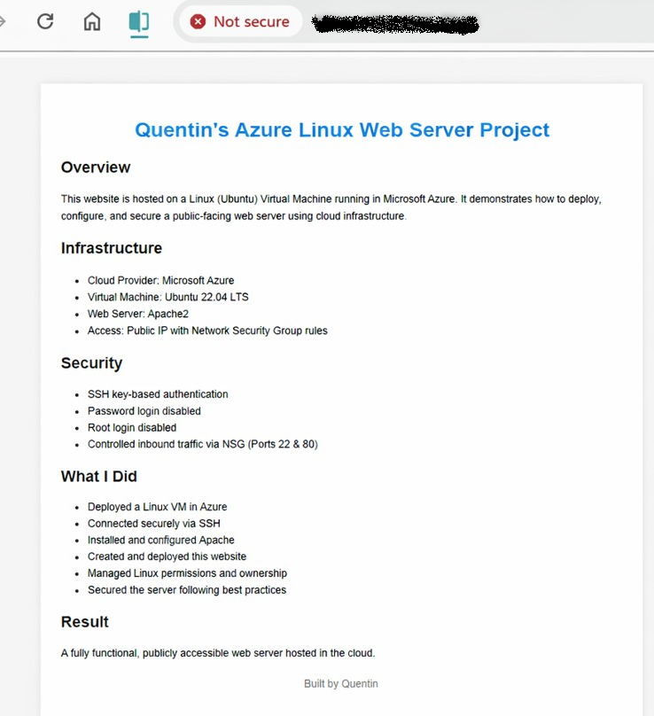
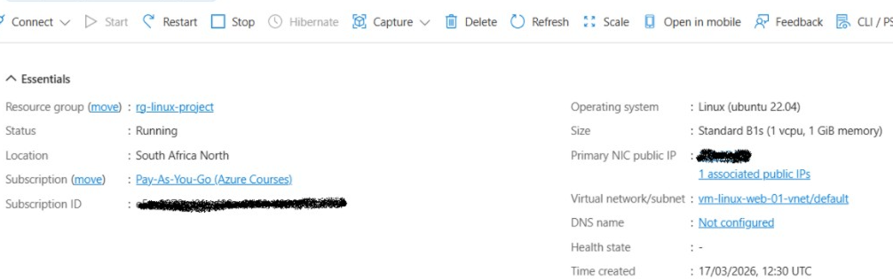
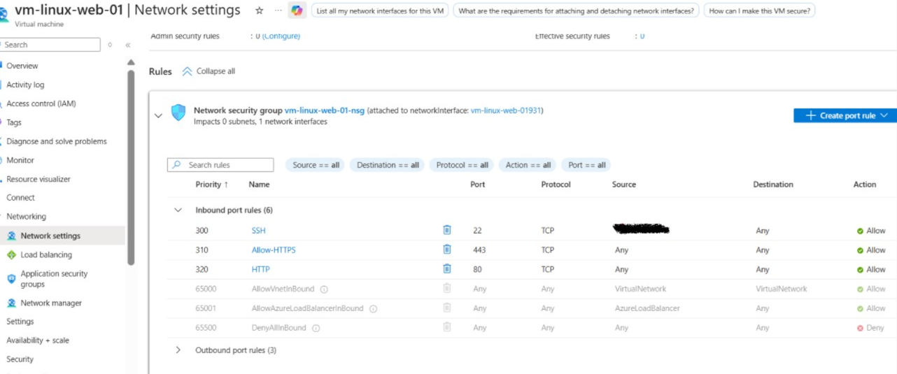
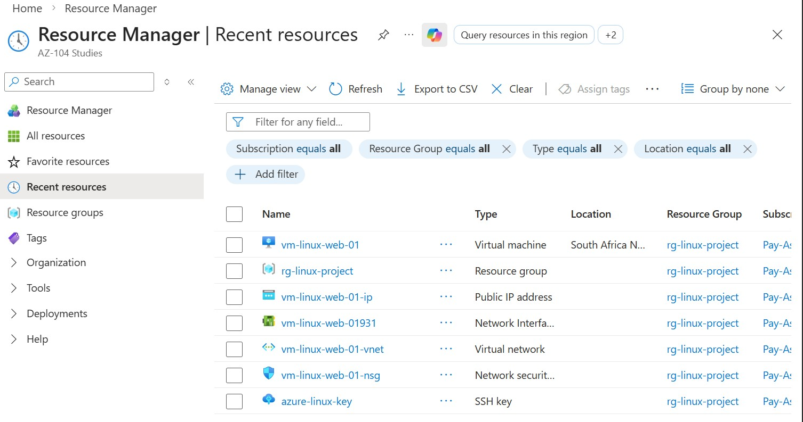
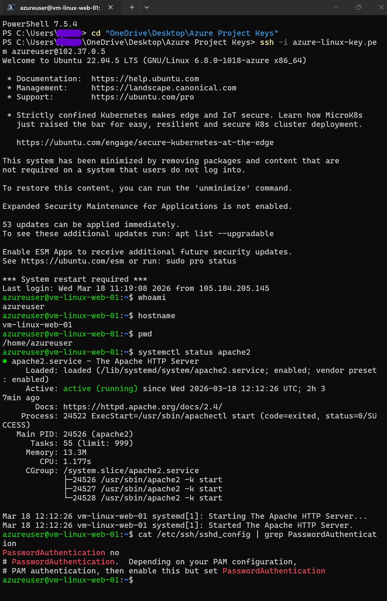

# Linux Azure Web Server Project

## Overview
This project demonstrates the deployment, configuration, and security hardening of a **public-facing Linux web server on Microsoft Azure**.

The objective was to simulate a real-world cloud engineering scenario by building and securing infrastructure using best practices in **Azure networking, Linux administration, and web server configuration**.

---

## Architecture Overview
The solution consists of:

- **Azure Virtual Machine (Ubuntu 22.04)** – Hosts the web server
- **Virtual Network (VNet)** – Provides network isolation
- **Network Security Group (NSG)** – Controls inbound traffic
- **Public IP Address** – Enables external access
- **Apache Web Server** – Serves web content over HTTP/HTTPS



---

## Deployment Approaches

This project demonstrates two approaches to deploying a Linux web server in Azure:

### Manual Deployment
- Virtual machine and services configured manually
- Apache installed and configured step-by-step
- Security settings applied manually (NSG, SSH hardening)

### Automated Deployment (cloud-init)
- Infrastructure deployed using Azure portal
- Configuration automated using cloud-init
- Apache installation and setup executed automatically during provisioning

The automated approach improves consistency, reduces manual effort, and reflects real-world infrastructure automation practices.

---

## Key Features

- Provisioned a Linux VM in Azure
- Configured secure inbound access using NSG rules
- Installed and configured Apache web server
- Hosted a custom static website
- Enabled HTTPS using SSL (self-signed certificate)
- Secured SSH access using key-based authentication
- Disabled password authentication and root login
- Configured automatic service startup on boot

---

## Security Implementation

Security was a key focus of this project:

### SSH Hardening
- Enforced key-based authentication
- Disabled password authentication
- Disabled root login

### Network Security
- NSG rules configured:
  - **Port 22 (SSH)** – Restricted access
  - **Port 80 (HTTP)** – Public access
  - **Port 443 (HTTPS)** – Public access

### HTTPS Configuration
- Generated SSL certificate using OpenSSL
- Enabled Apache SSL module
- Configured encrypted HTTPS traffic (port 443)

> Note: Self-signed certificate used (non-production setup)

---

## How It Works

1. User accesses the server via public IP (HTTP/HTTPS)
2. Azure NSG allows traffic based on defined rules
3. Apache web server processes the request
4. Content is served from `/var/www/html`
5. Browser renders the webpage

---

## Technologies Used

- Microsoft Azure
- Ubuntu Linux (22.04)
- Apache2
- SSH
- Bash
- OpenSSL

---

## Validation & Testing

- Verified Apache service status
- Confirmed HTTPS is active on port 443
- Validated SSL module is enabled
- Tested browser access via public IP

---

## Key Linux Commands

```bash
# Update system & install Apache
sudo apt update
sudo apt install apache2

# Manage Apache service
sudo systemctl start apache2
sudo systemctl enable apache2
sudo systemctl status apache2

# File permissions
chmod 644 index.html
chown azureuser:azureuser /var/www/html

# SSH key security
chmod 400 azure-linux-key.pem

# Enable SSL
sudo a2enmod ssl
sudo systemctl restart apache2

```
## Screenshots

### Website

### Azure VM Overview

### Network Security Group Rules

### Azure Resources

### SSH Access

```
```
## What I Learned
- Deploying and managing infrastructure in Azure
- Securing Linux servers using SSH best practices
- Configuring NSGs to control network traffic
- Hosting web applications using Apache
- Implementing HTTPS and understanding certificate trust
- Troubleshooting and validating services using Linux tools
```
```
## Future Improvements
- Use a domain name instead of public IP
- Implement trusted SSL certificates (Let’s Encrypt)
- Configure automatic certificate renewal
- Redirect HTTP → HTTPS
- Restrict SSH access to specific IP ranges
- Add firewall hardening (UFW)
- Deploy infrastructure using Terraform or Bicep
- Implement load balancing for high availability

## Result
A fully functional, secure, and publicly accessible Linux web server hosted in Azure, demonstrating core cloud engineering and system administration skills.


👨‍💻 Built by Quentin
